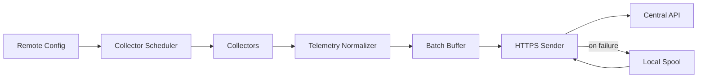

# Go Monitoring Agent Architecture

The InfraPilot agent is installed once per machine. After enrollment, it runs continuously as a Linux systemd service, Windows Service, container, or Kubernetes DaemonSet.

The agent only makes outbound HTTPS requests. It does not require inbound firewall rules, SSH, RDP, or VPN access.

## Responsibilities

- Enroll into an organization with an enrollment token.
- Generate and persist a stable machine fingerprint.
- Store the machine API key securely.
- Collect system, network, storage, process, Docker, Kubernetes, and OS-specific telemetry.
- Batch and compress metrics.
- Retry safely with exponential backoff.
- Spool unsent batches locally during outages.
- Send heartbeats and receive remote config.
- Support service install, uninstall, status, and key rotation commands.

## Suggested Agent Commands

```text
agentctl enroll --server https://api.infrapilot.example --token <enrollment-token>
agentctl status
agentctl service install
agentctl service uninstall
agentctl config show
agentctl rotate-key
```

The long-running service should be separate from the CLI where possible:

```text
agent run --config /etc/infrapilot/agent.yaml
```

## Local Configuration

Example:

```yaml
server_url: https://api.infrapilot.example
machine_id: 3a5347e4-7c17-4ae1-9b0a-0e8ee8bd7c2b
metrics_interval_seconds: 5
heartbeat_interval_seconds: 15
batch_max_samples: 60
spool_dir: /var/lib/infrapilot/spool
collectors:
  system: true
  disk: true
  network: true
  processes: true
  docker: auto
  kubernetes: auto
  logs: true
```

Secrets should not be stored in plain YAML. Use OS-specific secure storage where available:

- Linux: root-owned file with `0600` permissions, optionally kernel keyring or secret service.
- Windows: DPAPI-protected secret.
- Kubernetes: mounted secret with least-privilege RBAC.

## Collector Modules

System collector:

- CPU usage and core count.
- Memory usage.
- Swap usage.
- Load average.
- Uptime.
- Temperature when available.
- GPU when supported later.

Disk and storage collector:

- Filesystems and usage percent.
- Disk IO read/write throughput.
- IOPS.
- SMART status when available.
- LVM, RAID, NFS, NAS, SAN metadata when available.

Network collector:

- Upload and download throughput.
- Interface inventory.
- Latency and packet loss to configured targets.
- Connections and open ports.
- Bandwidth estimates.

Process collector:

- Running process count.
- Top CPU processes.
- Top memory processes.
- Command, user, PID, CPU, memory.

Docker collector:

- Containers, status, restart count.
- Container CPU and memory.
- Images, volumes, networks.
- Container logs when enabled.

Kubernetes collector:

- Cluster identity.
- Nodes and node readiness.
- Pods and pod phase.
- Deployments, ReplicaSets, namespaces, services.
- PVC/PV status and capacity.

Linux collector:

- systemd services.
- cron jobs.
- journal logs.
- kernel logs.
- logged-in users.

Windows collector:

- Windows services.
- Event logs.
- Performance counters.
- Installed updates and reboot-required state later.

## Scheduling

Collectors should run on independent intervals to avoid slow modules blocking fast metrics.

Recommended defaults:

| Collector | Interval |
| --- | --- |
| CPU/RAM/network/disk IO | 5 seconds |
| Filesystems/processes | 15 seconds |
| Docker/Kubernetes inventory | 30 seconds |
| Logs | streaming or 10 seconds |
| SMART/storage health | 5 minutes |
| Heartbeat | 15 seconds |
| Remote config | 60 seconds |

## Reliability

- Assign a UUID `batch_id` to each metric batch.
- Keep batches idempotent so retries do not duplicate logical samples.
- Compress large payloads with gzip or zstd.
- Bound local spool size to prevent disk exhaustion.
- Add jitter to intervals to avoid synchronized spikes from thousands of machines.
- Apply exponential backoff with max delay for failed sends.
- Drop or downsample low-priority data before critical heartbeat/metrics.

## Security

- Validate TLS certificates by default.
- Never log raw tokens or machine API keys.
- Hash tokens on the server.
- Rotate machine keys on demand and on a schedule.
- Run with least privilege; only enable privileged collectors when needed.
- Kubernetes DaemonSet should use minimal RBAC for node/pod/service/PVC discovery.
- Docker collector should be opt-in because Docker socket access is sensitive.

## Machine Fingerprint

Fingerprint should be stable but privacy-aware. Use a salted hash of available identifiers:

- OS machine ID or Windows MachineGuid.
- Hostname.
- Primary MAC address.
- Cloud instance ID if available.

The backend should treat `(organization_id, fingerprint)` as unique. Re-enrollment should update the existing machine rather than creating duplicates.

## Data Flow


