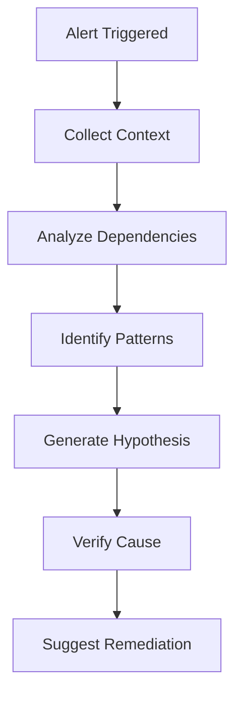

# InfraPilot Enterprise AI & Analytics Guide

## Overview

InfraPilot Enterprise incorporates AI-powered analytics to provide intelligent insights, anomaly detection, and predictive maintenance capabilities for your infrastructure.

## Features

- **Anomaly Detection:** Automatic detection of unusual patterns
- **Predictive Analytics:** Forecast resource usage and potential failures
- **Root Cause Analysis:** AI-powered incident investigation
- **Smart Alerting:** Reduce alert fatigue with intelligent filtering
- **Capacity Planning:** Predictive resource recommendations
- **Auto-Tuning:** Automatic performance optimization suggestions

## Architecture

### AI Pipeline

```
┌─────────────────┐
│  Metrics Feed   │
│  (Time Series)  │
└────────┬────────┘
         │
         ▼
┌─────────────────┐
│  Feature Store  │
│  - Aggregation  │
│  - Normalization│
│  - Windowing    │
└────────┬────────┘
         │
         ▼
┌─────────────────────────────────────┐
│      AI Models                       │
│  ┌────────────┐ ┌────────────────┐  │
│  │ Anomaly    │ │  Predictive    │  │
│  │ Detector   │ │  Forecaster    │  │
│  └────────────┘ └────────────────┘  │
│  ┌────────────┐ ┌────────────────┐  │
│  │ Root Cause │ │  Recommender   │  │
│  │ Analyzer   │ │  Engine        │  │
│  └────────────┘ └────────────────┘  │
└────────┬─────────────────────────────┘
         │
         ▼
┌─────────────────┐
│  Action Engine  │
│  - Alerts       │
│  - Suggestions  │
│  - Automation   │
└─────────────────┘
```

## Anomaly Detection

### Algorithm

Uses a combination of:
1. **Statistical Methods:** Z-score, IQR, moving averages
2. **Machine Learning:** Isolation Forest, LSTM, Prophet
3. **Ensemble:** Weighted voting for improved accuracy

### Configuration

```yaml
ai:
  anomaly_detection:
    enabled: true
    algorithms:
      - isolation_forest
      - lstm
      - statistical
    sensitivity: 0.95  # 95% confidence threshold
    window_size: 1h
    min_data_points: 100
    
    # Metric-specific thresholds
    thresholds:
      cpu_usage:
        warning: 80
        critical: 95
      memory_usage:
        warning: 85
        critical: 95
      disk_usage:
        warning: 80
        critical: 90
      response_time:
        warning: 500ms
        critical: 1000ms
```

### How It Works

```python
# Simplified anomaly detection flow
class AnomalyDetector:
    def detect(self, metrics, historical_data):
        # 1. Feature extraction
        features = self.extract_features(metrics)
        
        # 2. Ensemble prediction
        predictions = []
        
        # Statistical method
        z_score = self.calculate_zscore(metrics.value, historical_data)
        predictions.append(z_score > 3.0)
        
        # ML model
        isolation_score = self.isolation_forest.predict([features])
        predictions.append(isolation_score == -1)
        
        # LSTM prediction error
        predicted = self.lstm.predict(features)
        error = abs(predicted - metrics.value)
        predictions.append(error > self.threshold)
        
        # 3. Voting
        is_anomaly = sum(predictions) >= 2  # Majority vote
        
        return {
            'is_anomaly': is_anomaly,
            'confidence': self.calculate_confidence(predictions),
            'method': 'ensemble'
        }
```

## Predictive Analytics

### Use Cases

#### 1. Disk Space Prediction

```
Forecast: /var will be 95% full in 3.2 days
Trend: +2.3% per day
Recommendation: Clean logs or expand disk
```

#### 2. Memory Exhaustion

```
Warning: Memory may be exhausted in 12 hours
Based on: Current trend + seasonal patterns
Action: Review memory-intensive processes
```

#### 3. CPU Saturation

```
Prediction: CPU will exceed 90% during peak hours (14:00-16:00)
Confidence: 87%
Recommendation: Scale horizontally or optimize workload
```

### Implementation

```go
// internal/ai/predictor.go
type Predictor struct {
    model *prophet.Model
}

func (p *Predictor) Forecast(metrics []Metric, horizon time.Duration) (*Forecast, error) {
    // Prepare time series data
    ts := prepareTimeSeries(metrics)
    
    // Run prediction
    forecast, err := p.model.Predict(ts, horizon)
    if err != nil {
        return nil, err
    }
    
    return &Forecast{
        Timestamps: forecast.Timestamps,
        Values:     forecast.Values,
        LowerBound: forecast.LowerBound,
        UpperBound: forecast.UpperBound,
        Confidence: forecast.Confidence,
    }, nil
}
```

## Root Cause Analysis

### Workflow



### Example Output

```json
{
  "alert": "High CPU Usage",
  "analysis": {
    "root_cause": "Process 'java' consuming 450% CPU",
    "confidence": 0.92,
    "timeline": [
      "14:23:00 - CPU started increasing",
      "14:25:00 - Process 'java' spawned child processes",
      "14:27:00 - CPU reached 95%"
    ],
    "related_events": [
      "Deployment: app-v2.3.1 at 14:22:00",
      "Traffic spike: 3x normal load"
    ],
    "suggested_actions": [
      "Restart java process",
      "Rollback to app-v2.2.0",
      "Scale horizontally"
    ]
  }
}
```

## Smart Alerting

### Alert Deduplication

```
Incoming alerts: 50 similar alerts (high CPU)
AI groups into: 1 alert with 50 occurrences
Reduction: 98% alert noise
```

### Alert Correlation

```python
class AlertCorrelator:
    def correlate(self, alerts):
        # Group related alerts
        groups = {}
        for alert in alerts:
            signature = self.get_signature(alert)
            if signature not in groups:
                groups[signature] = []
            groups[signature].append(alert)
        
        # Identify causal relationships
        correlated = []
        for signature, group in groups.items():
            if len(group) > 5:
                correlated.append({
                    'type': 'cascade',
                    'source': group[0],
                    'affected': group[1:]
                })
        
        return correlated
```

## AI Configuration

### Model Training

```yaml
ai:
  training:
    enabled: true
    schedule: "0 2 * * *"  # Daily at 2 AM
    data_retention: 90d
    min_training_samples: 10000
    
    models:
      anomaly_detector:
        algorithm: isolation_forest
        retrain_interval: 7d
        
      forecaster:
        algorithm: prophet
        seasonality: daily, weekly
        
  inference:
    batch_size: 100
    max_latency: 100ms
    cache_predictions: true
```

### Model Deployment

```bash
# Train models
./infrapilot-ai train --data ./training-data --output ./models/

# Deploy models
kubectl apply -f k8s/ai-models.yaml

# Monitor model performance
curl http://localhost:8080/api/v1/ai/models/accuracy
```

## UI Integration

### AI Insights Widget

```javascript
function AIInsights({ machineId }) {
  const [insights, setInsights] = useState([]);

  useEffect(() => {
    const ws = new WebSocket(`/ws/ai/${machineId}`);
    ws.onmessage = (event) => {
      const insight = JSON.parse(event.data);
      setInsights(prev => [insight, ...prev]);
    };
  }, []);

  return (
    <div className="ai-insights">
      <h3>AI Insights</h3>
      {insights.map(insight => (
        <div key={insight.id} className={`insight ${insight.severity}`}>
          <div className="insight-icon">🤖</div>
          <div className="insight-content">
            <h4>{insight.title}</h4>
            <p>{insight.description}</p>
            <div className="confidence">
              Confidence: {(insight.confidence * 100).toFixed(0)}%
            </div>
            {insight.actions && (
              <div className="suggested-actions">
                {insight.actions.map((action, i) => (
                  <button key={i}>{action}</button>
                ))}
              </div>
            )}
          </div>
        </div>
      ))}
    </div>
  );
}
```

### Predictive Chart

```javascript
function PredictiveChart({ metrics }) {
  const options = {
    chart: { type: 'area' },
    series: [
      { name: 'Historical', data: metrics.historical },
      { name: 'Predicted', data: metrics.forecast }
    ],
    xaxis: { type: 'datetime' },
    stroke: { curve: 'smooth', width: [2, 2, 2], dashArray: [0, 0, 5] }
  };

  return <ReactApexChart options={options} series={options.series} />;
}
```

## Performance Metrics

### Model Accuracy

Track AI model performance:

```json
{
  "anomaly_detector": {
    "precision": 0.94,
    "recall": 0.89,
    "f1_score": 0.91
  },
  "forecaster": {
    "mape": 0.08,  // Mean Absolute Percentage Error
    "rmse": 0.12   # Root Mean Square Error
  }
}
```

### Latency

- **Inference time:** < 100ms per prediction
- **Batch processing:** 10,000 metrics/second
- **Model loading:** < 5 seconds

## Model Training

### Data Pipeline

```python
# Feature extraction
def extract_features(metrics, window='1h'):
    df = pd.DataFrame(metrics)
    
    features = {
        'mean': df['value'].mean(),
        'std': df['value'].std(),
        'min': df['value'].min(),
        'max': df['value'].max(),
        'trend': calculate_trend(df['value']),
        'seasonality': extract_seasonality(df),
        'autocorrelation': df['value'].autocorr(lag=10)
    }
    
    return features
```

### Model Selection

```python
from sklearn.ensemble import IsolationForest
from prophet import Prophet
from tensorflow import keras

# Anomaly detection
anomaly_model = IsolationForest(
    contamination=0.05,
    random_state=42
)

# Forecasting
forecast_model = Prophet(
    yearly_seasonality=False,
    weekly_seasonality=True,
    daily_seasonality=True
)

# Deep learning
lstm_model = keras.Sequential([
    keras.layers.LSTM(50, return_sequences=True, input_shape=(timesteps, features)),
    keras.layers.LSTM(50, return_sequences=False),
    keras.layers.Dense(25),
    keras.layers.Dense(1)
])
```

## Integration with Monitoring

### Metrics Sources

- **Infrastructure:** CPU, memory, disk, network
- **Application:** Response time, error rate, throughput
- **Business:** User activity, transactions, conversions
- **Logs:** Error patterns, access patterns

### Alert Flow

```
Detection → Analysis → Correlation → Decision
     ↓           ↓            ↓           ↓
  Anomaly    Root Cause    Context    Action
  Found       Identified    Gathered   Taken
     ↓           ↓            ↓           ↓
  Alert        Enriched     Prioritized  Resolved
  Triggered    with AI      & Grouped    Automatically
```

## Best Practices

1. **Start Simple:** Begin with statistical methods, add ML gradually
2. **Train Regularly:** Retrain models weekly with new data
3. **Monitor Models:** Track accuracy, drift, and false positives
4. **Human-in-the-Loop:** Validate AI suggestions before automation
5. **Explainability:** Always provide reasoning for AI decisions
6. **Feedback Loop:** Learn from operator feedback
7. **Gradual Rollout:** Enable AI features for 10% → 50% → 100%

## Troubleshooting

### Model accuracy is low

```bash
# Check training data quality
./infrapilot-ai validate --model anomaly_detector

# Retrain with more data
./infrapilot-ai train --model anomaly_detector --data ./new-data

# Adjust sensitivity
# Edit config.yaml
ai:
  anomaly_detection:
    sensitivity: 0.85  # Lower threshold
```

### High inference latency

```bash
# Enable model caching
ai:
  inference:
    cache_predictions: true
    cache_ttl: 5m

# Use smaller batch size
ai:
  inference:
    batch_size: 50
```

## Roadmap

- **v1.1:** Anomaly detection for all metric types
- **v1.2:** Predictive alerts with 7-day horizon
- **v1.3:** Automated remediation actions
- **v2.0:** Custom model training via UI
- **v2.1:** Multi-tenant model isolation
- **v2.2:** Federated learning across instances

## Research & References

- **Anomaly Detection:** https://arxiv.org/abs/2008.05169
- **Time Series Forecasting:** Facebook Prophet
- **Root Cause Analysis:** https://www.microsoft.com/en-us/research/project/root-cause-analysis/
- **Alert Correlation:** https://prometheus.io/docs/practices/alerting/