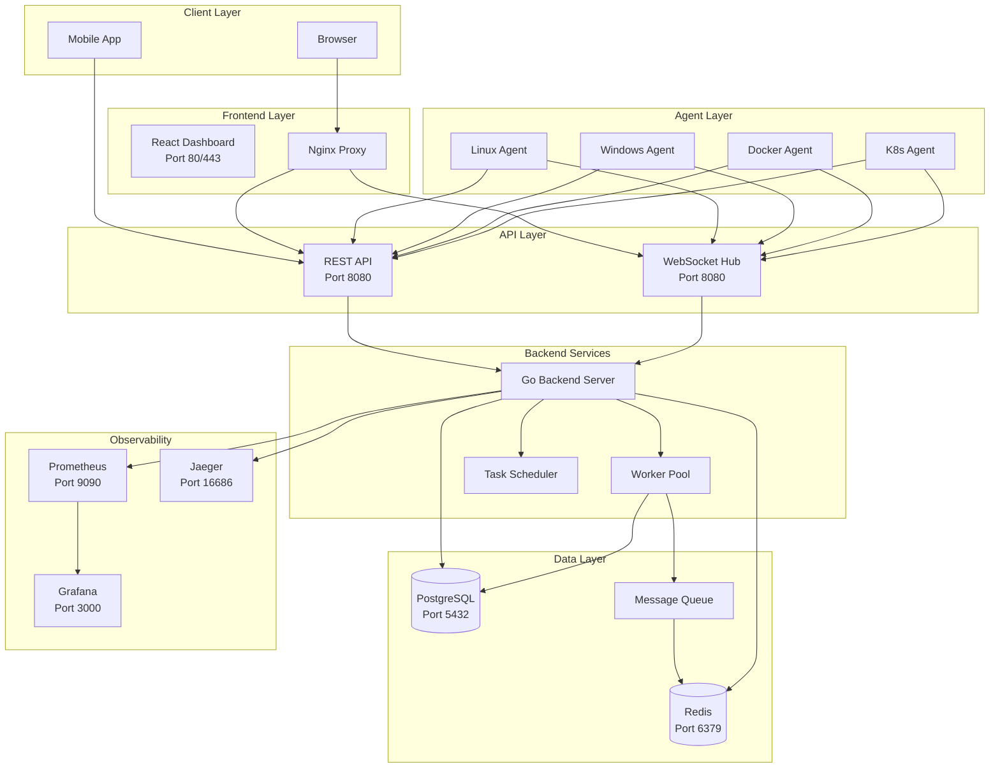

# InfraPilot Enterprise Architecture

## System Overview

InfraPilot Enterprise is a distributed infrastructure monitoring platform built with a microservices architecture. The system consists of three main components:

1. **Backend** (Go) - API server, WebSocket hub, event processing
2. **Frontend** (React) - Real-time dashboard and management interface
3. **Agent** (Go) - Lightweight monitoring agents deployed on target systems

## High-Level Architecture



## Component Details

### Backend

**Technology:** Go 1.24  
**Port:** 8080 (HTTP/WebSocket), 9090 (Metrics)  
**Responsibilities:**
- RESTful API for CRUD operations
- WebSocket connections for real-time data streaming
- Authentication & Authorization (JWT + RBAC)
- Event processing and distribution
- Report generation
- AI-powered analysis

### Frontend

**Technology:** React 18, Vite  
**Port:** 80 (HTTP), 443 (HTTPS)  
**Responsibilities:**
- Real-time dashboard with live metrics
- Machine management interface
- Terminal emulator
- File manager
- Report visualization
- Alert management

### Agent

**Technology:** Go 1.24  
**Port:** 8080 (configurable)  
**Responsibilities:**
- System metrics collection (CPU, Memory, Disk, Network)
- Process monitoring
- Docker container monitoring
- Kubernetes cluster monitoring
- Log collection
- Remote shell access
- File system operations

## Data Flow

### Metrics Collection Flow

```
Agent → Backend → Event Bus → Workers → PostgreSQL/Redis
                    ↓
              WebSocket → Frontend
                    ↓
              Prometheus → Grafana
```

### Alert Flow

```
Agent → Backend → Event Bus → Alert Subscriber → Database
                              ↓
                        WebSocket → Frontend
                              ↓
                         Email/Slack Notification
```

### Terminal Session Flow

```
Frontend → WebSocket → Backend → Agent
    ↑                        ↓
    └────────────────────────┘
```

## Database Schema

### Core Tables

- **users** - User accounts and authentication
- **machines** - Registered monitoring agents
- **sessions** - Active terminal sessions
- **metrics** - Time-series metrics data
- **alerts** - Alert definitions and history
- **reports** - Generated reports
- **audit_logs** - System audit trail

## Scalability

### Horizontal Scaling

- **Backend:** Stateless design allows multiple replicas behind load balancer
- **Frontend:** Nginx serves static files, multiple replicas supported
- **Database:** PostgreSQL with read replicas for reporting
- **Cache:** Redis Cluster for session management
- **Queue:** Redis Streams for event processing

### Performance Targets

- **API Latency:** < 50ms p95
- **WebSocket Throughput:** 10,000+ concurrent connections
- **Metrics Ingestion:** 100,000+ metrics/second
- **Query Response:** < 200ms for dashboard loads

## Security

- JWT-based authentication with refresh tokens
- Role-Based Access Control (RBAC)
- Password hashing with bcrypt
- HTTPS/TLS encryption
- CORS configuration
- Rate limiting
- SQL injection prevention
- XSS protection

## Deployment Options

### Docker Compose (Development/Small Scale)

```bash
docker compose up -d
```

### Kubernetes (Production)

```bash
kubectl apply -f k8s/
```

## Technology Stack

### Backend
- **Language:** Go 1.24
- **Framework:** Gin (HTTP), Gorilla (WebSocket)
- **Database:** PostgreSQL 15
- **Cache:** Redis 7
- **Queue:** Redis Streams
- **Monitoring:** Prometheus, Grafana, Jaeger
- **Testing:** Go test, testify

### Frontend
- **Language:** JavaScript (ES6+)
- **Framework:** React 18
- **Build:** Vite
- **Styling:** CSS3, Tailwind CSS
- **State:** Context API + Hooks
- **Charts:** Chart.js, ApexCharts
- **Terminal:** xterm.js

### Agent
- **Language:** Go 1.24
- **Plugins:** Linux, Windows, Docker, Kubernetes
- **Communication:** gRPC, WebSocket

## Monitoring the Platform

InfraPilot monitors itself using the same stack:

- **Backend health:** `/healthz` endpoint
- **Metrics:** Prometheus exposition format
- **Traces:** OpenTelemetry to Jaeger
- **Logs:** Structured JSON logging

## Future Enhancements

- Multi-tenancy support
- Plugin system for custom monitors
- Machine learning for anomaly detection
- mobile applications
- GraphQL API
- Cloud provider integrations (AWS, Azure, GCP)