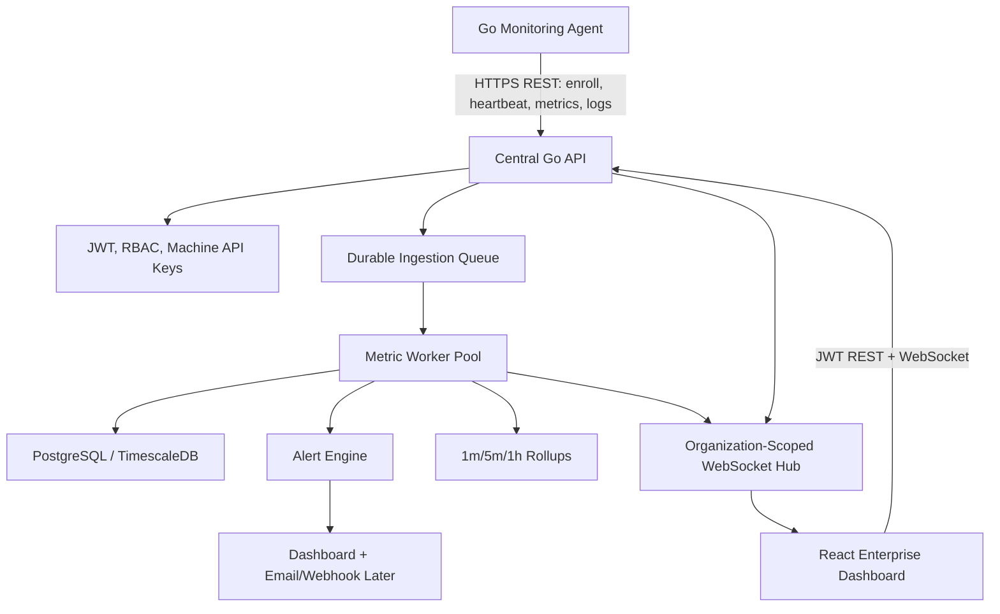
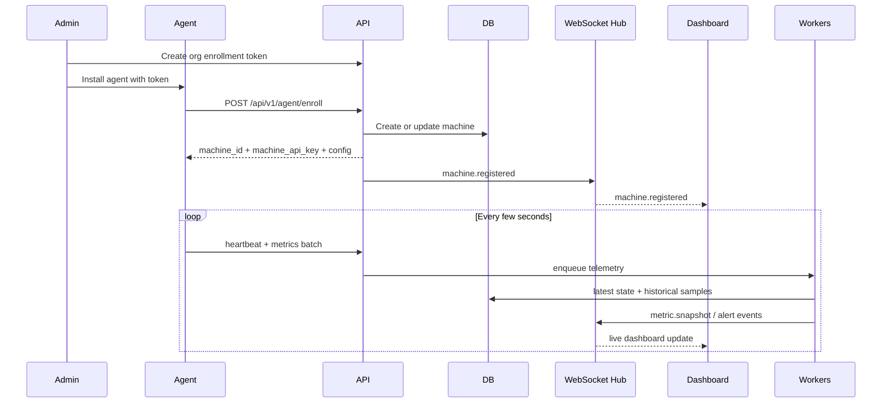

# InfraPilot Enterprise Architecture

InfraPilot Enterprise is a multi-tenant AI-ready infrastructure monitoring platform. It uses a central control plane, lightweight Go agents installed on customer machines, PostgreSQL for tenant and telemetry data, worker pools for ingestion, and WebSockets for real-time dashboard updates.

Agents initiate outbound HTTPS connections to the platform. The central server never needs SSH, RDP, VPN access, or manual per-machine connections.

## 1. Target Folder Structure

```text
InfraPilot-Enterprise/
  backend/
    cmd/
      api/                         # REST and WebSocket API server
      worker/                      # metric, alert, rollup, and notification workers
      migrate/                     # database migration runner
    internal/
      app/                         # dependency wiring and lifecycle
      config/
      domain/
        organizations/
        users/
        machines/
        metrics/
        alerts/
        logs/
        docker/
        kubernetes/
        storage/
        networking/
      repository/
        postgres/
      services/
      pipeline/                    # ingestion queues, worker pools, fan-out
      transport/
        http/
        websocket/
      auth/
      rbac/
      observability/
    migrations/
    Dockerfile
  agent/
    cmd/
      agent/                       # long-running daemon/service
      agentctl/                    # enrollment/status CLI
    internal/
      auth/
      config/
      identity/
      collectors/
        system/
        disk/
        network/
        process/
        docker/
        kubernetes/
        storage/
        linux/
        windows/
      sender/
      heartbeat/
      spool/
      updater/
    packaging/
      linux/systemd/
      windows/service/
      docker/
    Dockerfile
  frontend/
    src/
      app/
      api/
      auth/
      components/
      features/
        overview/
        organizations/
        machines/
        alerts/
        analytics/
        admin/
      routes/
      websocket/
      charts/
    Dockerfile
  deploy/
    docker-compose.yml
    k8s/
      api/
      worker/
      frontend/
      postgres/
      redis/
      ingress/
      observability/
  docs/
```

## 2. High-Level Architecture



Core principles:

- Every record is tenant-scoped by `organization_id`.
- Agents push metrics to the platform; the platform does not poll private networks.
- Raw ingestion is decoupled from persistence through queues and workers.
- Latest state and historical metrics are stored separately.
- WebSockets broadcast summarized live state, not every raw sample at unlimited frequency.
- RBAC is enforced at every organization, machine, alert, and analytics endpoint.

## 3. Multi-Tenant Model

Hierarchy:

```text
Platform
  Organization
    Users
    Enrollment tokens
    Machines
      Metrics
      Logs
      Processes
      Filesystems
      Containers
      Kubernetes resources
      Alerts
```

Example:

- Company A has 100 Linux servers under organization `company-a`.
- Company B has 300 Windows servers under organization `company-b`.
- Company C has a Kubernetes cluster under organization `company-c`.

Each company logs into the same platform but only sees its own machines, alerts, logs, tokens, and analytics. Platform admins can manage all organizations; organization owners/admins manage only their tenant.

## 4. Backend Architecture

Use Go with clean architecture boundaries:

- `domain`: entities, value objects, and interfaces. No Gin/Fiber/GORM imports.
- `repository/postgres`: SQL persistence, migrations, pagination, tenant filters.
- `services`: business rules for auth, enrollment, machine inventory, metrics, alerts, and RBAC.
- `transport/http`: REST handlers, validation, request/response DTOs.
- `transport/websocket`: authenticated subscriptions and live event fan-out.
- `pipeline`: ingestion queue adapters, worker pools, rollup generation, alert evaluation.
- `observability`: OpenTelemetry traces, metrics, structured logs, health checks.

Recommended backend processes:

- `api`: stateless REST and WebSocket service.
- `worker`: consumes metric/log queues, writes DB, evaluates alerts, emits live events.
- `scheduler`: offline detection, retention cleanup, rollups, AI jobs.

Core services:

- Organization service: tenant lifecycle, quotas, retention policy, plan limits.
- User service: login, password management, organization membership.
- RBAC service: platform admin, owner, admin, operator, viewer permissions.
- Enrollment service: org-scoped enrollment tokens and machine API keys.
- Machine service: inventory, tags, status, last-seen, config assignment.
- Metric service: validation, ingestion, latest state, history, rollups.
- Alert service: rule evaluation, state transitions, acknowledgement, resolution.
- Docker service: containers, images, volumes, networks, logs.
- Kubernetes service: clusters, nodes, pods, workloads, services, PV/PVC.
- Storage service: filesystems, block devices, RAID, LVM, SMART, IOPS.
- WebSocket service: organization rooms, machine channels, throttled broadcasts.

## 5. Frontend Architecture

Target stack:

- React + TypeScript
- Vite
- Tailwind CSS or an internal design system
- TanStack Query for REST caching
- WebSocket client for live updates
- ECharts, Recharts, or Nivo for charts
- Zod or similar validation for API DTOs

Main views:

- Enterprise overview: organizations, total machines, online/offline, aggregate CPU, RAM, storage, network, bandwidth, busy servers, open alerts.
- Organization dashboard: tenant-scoped status, filters, alert stream, inventory health.
- Machine inventory: search, OS/type/status/tag filters, bulk actions.
- Machine detail: identity, CPU/RAM/storage/network/processes/Docker/Kubernetes/logs.
- Historical analytics: 1h, 24h, 7d, 30d charts for CPU, memory, storage, network, bandwidth, disk IO.
- Alerts: open/acknowledged/resolved, severity filters, rule management.
- Admin: users, roles, enrollment tokens, API tokens, retention, quotas.

Real-time behavior:

- Dashboard opens one WebSocket per selected organization.
- Overview receives aggregate organization snapshots every 2-5 seconds.
- Machine detail subscribes to a specific machine channel for higher-resolution updates.
- REST remains the source of truth for initial load, pagination, and historical data.

## 6. Database Design

Use PostgreSQL as the system of record. For high-volume metrics, use TimescaleDB hypertables or native PostgreSQL partitioning by time, optionally subpartitioned by organization.

Core groups:

- Identity: `organizations`, `users`, `organization_members`, `refresh_tokens`.
- Enrollment: `enrollment_tokens`, `machine_api_keys`.
- Inventory: `machines`, `machine_tags`, `machine_latest_state`.
- Telemetry: `metric_samples`, `metric_rollups_1m`, `metric_rollups_1h`.
- Alerts: `alert_rules`, `alerts`, `alert_events`.
- Logs and processes: `logs`, `process_snapshots`.
- Network/storage: `network_interfaces`, `network_connections`, `open_ports`, `storage_devices`, `filesystems`.
- Docker: `docker_containers`, `docker_images`, `docker_volumes`, `docker_networks`.
- Kubernetes: `kubernetes_clusters`, `kubernetes_nodes`, `kubernetes_pods`, `kubernetes_workloads`, `kubernetes_services`, `kubernetes_volumes`.
- Audit: `audit_logs`.

See [database-schema.sql](database-schema.sql) for the baseline SQL schema.

## 7. API Surface

All user APIs use JWT. All agent APIs use enrollment tokens during first registration and machine API keys after enrollment.

Primary API groups:

- Auth: login, refresh, current user, logout.
- Organizations: tenant CRUD, overview, quotas, retention.
- Users and roles: membership, invitations, role changes.
- Enrollment: create/list/revoke enrollment tokens.
- Agent: enroll, heartbeat, metrics, logs, config, key rotation.
- Machines: list, details, tags, latest state, historical metrics.
- Alerts: list, rules, acknowledge, resolve.
- Docker/Kubernetes/Storage/Network: detail endpoints and filtered queries.

See [api-and-websocket.md](api-and-websocket.md) for concrete endpoint contracts and event envelopes.

## 8. Agent Architecture

The agent is a lightweight Go service installed on Linux servers, Windows servers, Docker hosts, Kubernetes nodes, storage servers, VMs, and cloud instances.

Responsibilities:

- Enroll using an organization token or admin login.
- Generate a stable machine fingerprint.
- Store machine API keys securely.
- Collect metrics on schedules.
- Batch, compress, and send telemetry over HTTPS.
- Retry with backoff and local spooling during network outages.
- Send heartbeat and receive remote config.
- Collect optional Docker/Kubernetes/storage details when available.

See [agent-architecture.md](agent-architecture.md) for collector modules, payload shape, service packaging, and enrollment flow.

## 9. Machine Registration Flow



## 10. Data Collection Flow

1. Agent collectors run on independent intervals.
2. The agent normalizes results into a common telemetry envelope.
3. Samples are batched, compressed, and sent over HTTPS.
4. API validates machine API key, payload size, org ownership, and schema version.
5. API places accepted telemetry into a durable ingestion queue.
6. Workers write latest state and historical samples.
7. Rollup workers produce 1-minute and 1-hour aggregates.
8. Alert workers evaluate thresholds and state transitions.
9. WebSocket hub broadcasts organization-scoped snapshots.
10. Frontend updates cards, tables, and charts without page refresh.

## 11. Alerting

Initial deterministic rules:

- CPU usage greater than 90%.
- Memory usage greater than 90%.
- Disk/filesystem usage greater than 90%.
- Machine offline after missed heartbeats.
- Container stopped or unhealthy.
- Kubernetes pod failed or crash-looping.
- Kubernetes node not ready.
- Storage full or disk health degraded.

Alert lifecycle:

```text
detected -> open -> acknowledged -> resolved
```

Rules should support severity, threshold, duration, scope, mute windows, and per-organization overrides.

## 12. Deployment

Development can run on Docker Compose. Production should run on Kubernetes or managed container infrastructure.

Production components:

- API deployment, horizontally scalable.
- Worker deployment, scaled by queue depth.
- Scheduler deployment, singleton or leader-elected.
- Frontend static deployment behind CDN/ingress.
- PostgreSQL managed database, preferably with TimescaleDB for telemetry.
- Redis/NATS/Kafka for durable ingestion and WebSocket coordination.
- Object storage for long-term logs or large artifacts.
- TLS ingress, secrets manager, backup policy, and observability stack.

See [deployment.md](deployment.md) for Docker Compose, Kubernetes, security, and scaling guidance.

## 13. Production Scalability Practices

- Store latest state separately from historical metrics.
- Partition metrics by time and index by `(organization_id, machine_id, sampled_at DESC)`.
- Batch inserts with `COPY` or multi-row statements.
- Use a durable queue between API and workers.
- Apply rate limits per organization and per machine.
- Reject oversized payloads and unknown schema versions.
- Use idempotency keys for agent batch retries.
- Keep WebSocket fan-out tenant-scoped and throttled.
- Broadcast snapshots every 2-5 seconds instead of every raw metric.
- Use read replicas for historical analytics.
- Add retention policies and downsampling by plan.
- Hash all tokens and machine keys at rest.
- Rotate machine API keys and JWT signing keys.
- Add audit logs for admin, token, role, and machine actions.
- Monitor the monitoring platform with OpenTelemetry, Prometheus, and Grafana.

## 14. AI Roadmap

Build reliable telemetry and alerting first. AI becomes valuable after the platform has enough historical data.

Phase 1:

- Threshold alerts for CPU, RAM, disk, offline machines, containers, pods, and nodes.
- Trend warnings for storage exhaustion.

Phase 2:

- Per-machine and per-organization baselines.
- Anomaly detection for CPU, memory, network, disk IO, and process behavior.

Phase 3:

- Disk failure prediction using SMART and IO history.
- Storage exhaustion forecasting.
- Network traffic anomaly detection.
- CPU spike and workload-change detection.

Phase 4:

- AI-generated remediation recommendations.
- Incident summaries from metrics, alerts, logs, and topology.
- Capacity planning and cost recommendations.
